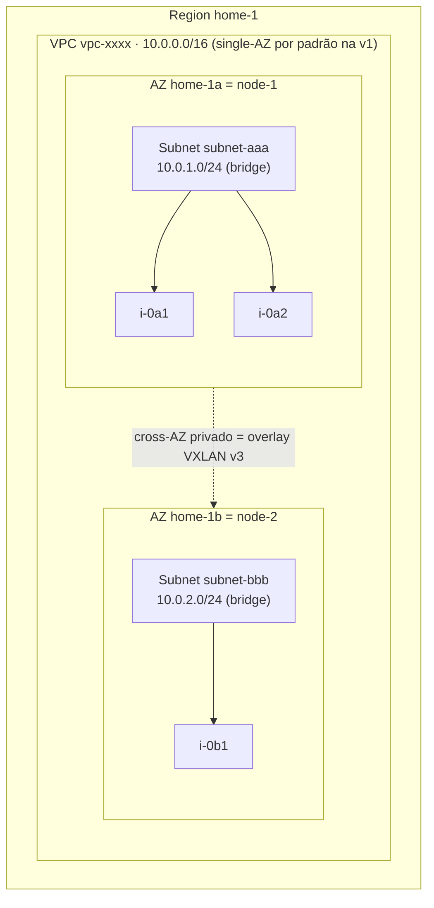
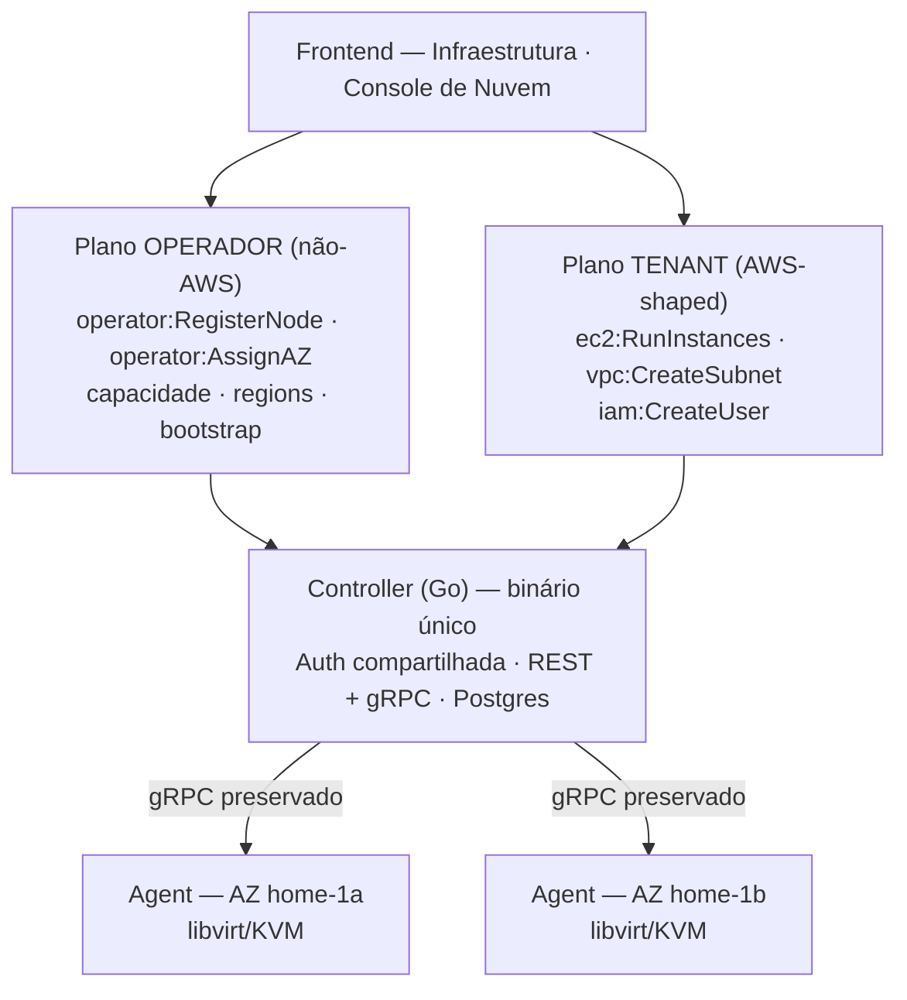
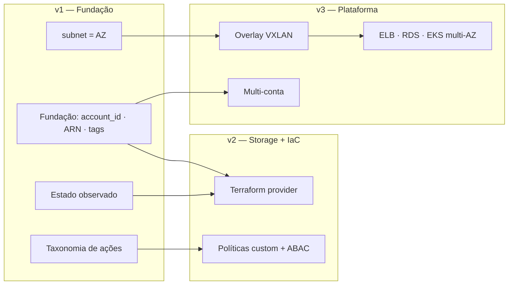

# RigStack → Nuvem AWS-like: Plano de Adequação

> **Tipo:** Plano de arquitetura e migração (entregável de consultoria)
> **Autor:** Ronaldo Rodrigues — Consultor de Infraestrutura IaC/Cloud
> **Data:** 2026-06-02
> **Status:** Proposta para apresentação
> **Escopo do entregável:** *plan* (decisões, arquitetura-alvo, roadmap e riscos). Não inclui implementação.

---

## 1. Sumário executivo

O RigStack já é, hoje, uma nuvem privada funcional para homelab: provisiona VMs (libvirt/KVM), redes VPC (Linux bridge + NAT) e tem um modelo controller+agent sólido com gRPC. Este plano propõe **reformatar o RigStack para o modelo mental da AWS** — não para ser *wire-compatible* com a AWS, mas para que entusiastas de homelab gerenciem sua infraestrutura com os mesmos conceitos (EC2, VPC, Subnet, Security Group, IAM, ARNs) e, em seguida, **como código** via um provider Terraform/OpenTofu nativo.

**North-star:** *"Sua própria nuvem, com o modelo mental da AWS, no seu hardware — gerenciável por IaC."*

**Princípios que guiaram cada decisão:**

1. **Reaproveitar o que vale ouro.** O agent (libvirt, bridges, iptables, netns, bootstrap via curl) e o gRPC controller↔agent são preservados e estendidos. O redesenho concentra-se no modelo de domínio e na API.
2. **Imitar a AWS onde serve ao homelab; divergir conscientemente onde não serve.** O público tem 1–3 máquinas; o plano para de imitar a complexidade da AWS exatamente onde ela deixa de agregar.
3. **Carregar a fundação cedo.** `account_id`, ARNs completos e slots de AZ entram desde a v1 — porque adicioná-los depois quebra identificadores persistidos, políticas IAM e estado Terraform.
4. **Honestidade de escopo.** Compatibilidade de fio com a AWS e roteamento multi-AZ são explicitamente adiados, com o porquê documentado.

**As três fases:**

| Fase | Tema | Entregas |
|------|------|----------|
| **v1** | Fundação AWS-shaped | EC2, VPC + Subnet, Security Groups, IAM single-account, `account_id`/ARNs/IDs estilo AWS, dois planos de API |
| **v2** | Storage + DX/IaC | S3 (MinIO), volumes EBS-like, Elastic IP, CLI `rigstack`, **provider Terraform** |
| **v3** | Plataforma distribuída | Overlay VXLAN (destrava multi-AZ), ELB, RDS, EKS, multi-conta |

---

## 2. Avaliação do estado atual (baseada em evidência no código)

O plano nasce de uma leitura do repositório, não de premissas. Achados que moldam o desenho-alvo:

### 2.1 O que já funciona e será reaproveitado
- **Controller** (Go, REST `:8080` + gRPC `:9090`, PostgreSQL): scheduler *least-loaded*, dispatcher por heartbeat. Sólido.
- **Agent** (Go, bare-metal/systemd): libvirt/KVM, Linux bridge, iptables NAT, network namespace, provisionamento qcow2, **bootstrap via `curl | sh`** (estilo k3s). É a *joia da coroa*.
- **Frontend** (React): já tem páginas *ComingSoon* para IAM, Object Storage, Load Balancer, Databases, Kubernetes, Containers — a ambição visual já existe.
- **Schema**: tabelas `nodes`, `vpcs`, `subnets`, `nat_gateways`, `instances`, `users` já existem.

### 2.2 Lacunas estruturais (o que o plano precisa resolver)

| # | Achado (arquivo) | Impacto |
|---|------------------|---------|
| **G1** | **VPC vive em um único node.** `VPCService.Create` (`vpc.go:38`) cria a bridge em *um* node via `PickNode`; `InstanceService.Create` (`instance.go:99`) chama `PickNode` **independentemente** — a VM pode cair em node diferente da bridge. Sem overlay (VXLAN/Geneve). | Rede multi-node está, na prática, **quebrada**. É a restrição técnica central do plano. |
| **G2** | **Tabela `subnets` existe mas é ignorada.** `allocateIP` (`instance.go:219`) aloca direto do CIDR da VPC, sequencial a partir de `.11`. | Não há IPAM real nem o conceito AWS de subnet=AZ. |
| **G3** | **Zero autenticação.** `auth.go` só tem CORS; comentário promete "Fase B: JWT". Tabela `users` (`admin/developer/viewer`) não está ligada a login. | IAM e auth são *greenfield* — vantagem: projeta-se certo desde já. |
| **G4** | **Sem `account_id`/owner em nenhum recurso.** Recursos são globais no controller. | Multi-tenancy e IAM por recurso precisam de fundação nova. |
| **G5** | **`region` é string solta no node.** Sem AZ, sem tabela de regions, sem ARNs. | Topologia AWS precisa ser introduzida. |
| **G6** | **Scheduling desacoplado da rede.** Scheduler escolhe por RAM livre, sem considerar onde a subnet/bridge da instância existe. | Corrigido naturalmente pelo modelo subnet=AZ. |

---

## 3. Arquitetura-alvo

### 3.1 Modelo conceitual (mapeamento RigStack → AWS)

| Conceito AWS | RigStack-alvo | Realização física |
|---|---|---|
| Account | Conta única na v1 (`account_id` carregado desde já) | Coluna `account_id` em todo recurso |
| Region | `home-1` (única na v1) | Todo o deployment |
| Availability Zone | **Slot lógico estável** (`home-1a`, `home-1b`…) | Um **node atribuído** ao slot |
| EC2 instance (`i-`) | Instance | VM libvirt/KVM no node da AZ |
| AMI (`ami-`) | Image | qcow2 base em `/var/lib/rigstack/base/` |
| VPC (`vpc-`) | VPC — guarda-chuva de CIDR regional, **single-AZ por padrão na v1** | Conceito lógico |
| Subnet (`subnet-`) | Subnet — **escopada a uma AZ** | Bridge Linux no node daquele slot |
| Security Group (`sg-`) | Security Group — stateful | iptables (conntrack) por-VM |
| Internet Gateway (`igw-`) | IGW por VPC | Reusa NAT gateway (netns) |
| Elastic IP (`eip-`) | EIP (v2) | iptables DNAT |
| EBS volume (`vol-`) | Volume (v2) | qcow2 anexável, escopado à AZ |
| IAM user/group/role/policy | IAM (single-account v1) | Tabela `users` + políticas |

**Invariante preservado:** na AWS, tudo dentro de uma VPC se fala por IP privado. Como não há overlay na v1, **uma VPC é single-AZ por padrão** — assim a semântica AWS fica *correta porém limitada*, em vez de *com cara de AWS porém errada*. VPC multi-AZ é destravada pelo overlay (v3).

**AZ = slot, não node:** decomissionar um node **não destrói a AZ**. O node é *atribuído* ao slot; trocou a máquina, a AZ persiste (recursos ficam indisponíveis até um node reocupar o slot). A AZ fica **oculta na UI até haver 2+ nodes**.

### 3.2 Dois planos de API

O dono do homelab usa dois chapéus — operador de infraestrutura e usuário de nuvem. A API reflete isso:

- **Mesmo binário, mesma auth** (seção 3.3); **namespaces de rota e taxonomias IAM distintos**.
- O `/api/v1/nodes` e o `/agent/install.sh` atuais migram para o **plano de operador**.
- O plano de operador é onde mora a futura gestão **multi-conta** (v3).

### 3.3 Autenticação e autorização

- **Console (UI):** login usuário/senha → **JWT** de sessão.
- **Programático (CLI/Terraform):** **Access Key ID + Secret Access Key**, enviados como **bearer sobre TLS** — **não SigV4**. O secret é guardado só como **hash salgado (Argon2id)**, exibido uma única vez (ver ADR-013). `rigstack configure` espelha `aws configure`; o provider recebe `access_key`/`secret_key` como o provider AWS. Chaves escopadas a um IAM user/role, exibidas **só uma vez**.
- **IAM (autorização):** estrutura AWS (users/groups/roles) + formato `Effect/Action/Resource`. **v1:** catálogo curado de *managed policies* (`AdministratorAccess`, `EC2FullAccess`, `VPCReadOnly`, `OperatorAccess`…), **sem `Condition`**, matching nível-serviço, avaliador simples (Deny vence; Allow explícito vence ausência). A **taxonomia de ações por serviço é definida na v1** — é o vocabulário que as políticas custom da v2/v3 vão consumir.

### 3.4 Identidade de recurso

- **ARN completo desde a v1:** `arn:rigstack:<service>:<region>:<account>:<type>/<id>`
  - Ex.: `arn:rigstack:ec2:home-1:000000000001:instance/i-0a1b2c3d`
  - `region` e `account` **preenchidos** mesmo com um só de cada (blank-then-fill quebraria ARNs gravados e estado Terraform).
- **IDs estilo AWS, prefixos decididos upfront:** `i-`, `vol-`, `vpc-`, `subnet-`, `sg-`, `igw-`, `nat-`, `eip-`, `key-`, `ami-`. Gerador determinístico e único por tipo, na fundação.

---

## 4. Architecture Decision Records (ADRs)

> Cada ADR registra contexto, opções, decisão e **alternativa rejeitada com o porquê** — a defensabilidade do plano.

### ADR-001 — Paridade de modelo AWS, não compatibilidade de fio
- **Decisão:** Adotar o *modelo/UX* da AWS com API própria (B), seguida de um provider Terraform nativo (C).
- **Rejeitado:** Compatibilidade de fio (A, estilo LocalStack — EC2 query/XML + SigV4). Motivo: reescreveria a API atual para imitar um alvo externo gigante e móvel, ROI péssimo para homelab, e cria expectativa de "drop-in AWS" impossível de cumprir. **Não se precisa de wire-compat para ser gerenciável por IaC** — toda nuvem tem seu próprio provider.

### ADR-002 — Multi-user, single-account na v1
- **Decisão:** Várias pessoas, uma conta (b). Todo recurso carrega `account_id`/owner desde já.
- **Rejeitado:** Single-tenant puro (a) — mataria o IAM e o fio condutor AWS. Multi-conta completo (c) — armadilha de escopo para v1 (isolamento real de rede/storage/compute por conta). Fundação carregada habilita (c) sem refazer migração.

### ADR-003 — Topologia: AZ = slot lógico, VPC single-AZ na v1
- **Decisão:** Region única; **AZ = slot estável** com node atribuído; **subnet escopada à AZ** (= bridge no node); VPC single-AZ por padrão; colocação da instância derivada da subnet. AZ oculta até 2+ nodes.
- **Rejeitado:** Construir overlay VXLAN cross-node já na v1 (a). Motivo: não elimina nenhum risco, só antecipa a engenharia mais difícil do projeto contra o objetivo de reaproveitar, por um benefício que o homelabber de 1 node não usa.
- **Riscos aceitos:** ver R1–R3 na seção 6.

### ADR-004 — Escopo faseado v1/v2/v3
- **Decisão:** v1 reaproveita+reorganiza (baixo risco, demonstrável); v2 entrega o valor IaC; v3 é a infra distribuída pesada. Ver seção 5.

### ADR-005 — Auth híbrida (JWT + Access Keys, **bearer**, sem SigV4)
- **Decisão:** Console JWT; programático Access Key/Secret como **bearer sobre TLS**. A escolha de **bearer (não HMAC)** é selada pelo ADR-013: HMAC obrigaria a guardar o secret de forma reversível, contra o princípio de segredo de auth irrecuperável.
- **Rejeitado:** SigV4 completo (a) — reintroduz o custo de wire-compat rejeitado em ADR-001, no servidor *e* na CLI/provider. HMAC — força armazenamento reversível do secret (ver ADR-013).

### ADR-006 — IAM: estrutura AWS + managed policies curadas
- **Decisão:** Estrutura e formato de política AWS, mas v1 só com catálogo curado, sem `Condition`, matching nível-serviço; taxonomia de ações definida na v1.
- **Rejeitado:** Motor de política completo (b, curingas de ARN + condições) na v1 — item de IAM mais caro, adiável. RBAC simples (a) — não é IAM, fere a paridade.

### ADR-007 — ARN completo desde o dia 1
- **Decisão:** Formato AWS completo com region/account preenchidos.
- **Rejeitado:** ARN simplificado com campos vazios (b) — preenchê-los depois quebra ARNs em políticas IAM e estado Terraform de usuários.

### ADR-008 — Evolução híbrida, campo limpo na API
- **Decisão:** Preservar+estender agent/gRPC/executor; redesenhar controller service/store/API; **sem compatibilidade retroativa na API** (não há base instalada); migrações aditivas + uma migração de dados.
- **Rejeitado:** Reconstrução total (b) — descarta a joia da coroa. Evoluir tudo no lugar mantendo a API antiga (parte de a) — carrega dívida de compatibilidade que ninguém pediu.

### ADR-009 — Dois planos de API (operador + tenant)
- **Decisão:** Plano de operador (não-AWS, hardware) separado do plano tenant (AWS-shaped). Mesmo binário e auth; namespaces distintos.
- **Rejeitado:** API unificada (a) — vazaria `nodes` para a API AWS-shaped, quebrando a ilusão e sujando o IAM.

### ADR-010 — Security Groups stateful via iptables (v1), SG-a-SG na v2
- **Decisão:** SGs **stateful** (conntrack, não NACL stateless), aplicados como **chains iptables por-VM no agent** (host-level, à prova de bypass pelo tenant); default **deny inbound / allow all outbound**; **SG default por VPC** com **auto-referência** (instâncias do mesmo default SG se falam). Regras na v1 por **CIDR** + a auto-referência do default.
- **Rejeitado/diferido:** Referência **SG-a-SG arbitrária** (b) → **v2**, porque exige propagação dinâmica de *membership* (controller resolve SG→IPs e re-propaga aos agents a cada mudança), que casa com o estado observado maduro e as políticas custom da v2. Só CIDR sem auto-referência (c) — SGs ficam toscos. **NACLs** (stateless, nível de subnet) — fora de escopo / v3.

### ADR-011 — Overlay VXLAN com FDB unicast via controller (v3)
- **Decisão:** **VXLAN** (L2/UDP nativo do kernel, casa com as bridges Linux atuais) como overlay cross-node. **Control plane = FDB unicast dirigido pelo controller** (head-end replication via o canal de dispatch existente) — **sem multicast** (quebra na maioria das LANs domésticas). Overhead de MTU (~50 bytes) tratado via jumbo frames ou MTU reduzido (documentado).
- **Rejeitado:** Geneve (b)/OVN-OVS (d) — fardo operacional pesado demais pro homelab. Multicast FDB — indisponível na LAN doméstica típica.
- **Reservado:** **WireGuard** para **multi-site/multi-region** (túnel L3 cifrado sobre internet) — caso de uso distinto, fase futura.
- **Gatilho:** o overlay é **pré-requisito de qualquer serviço multi-AZ** (ELB cross-AZ, réplica RDS, EKS multi-AZ).

### ADR-012 — Tags como metadado de 1ª classe na v1; ABAC na v2
- **Decisão:** Coluna `tags` (JSONB) key/value em **todo recurso desde a v1** (mesma lógica de "carregar cedo" de `account_id`/ARN), com a convenção da tag `Name` para exibição e tags filtráveis nos `Describe*`. Semântica de **organização/filtro apenas** na v1.
- **Rejeitado:** Tags + ABAC na v1 (b) — traria `Condition` de volta pra v1, contra o ADR-006. Tags só na v2 (c) — recursos da v1 nasceriam sem como ser taggeados e usuários de Terraform esperam `tags = {...}` no dia 1.
- **Diferido:** controle de acesso por tag (ABAC, `aws:ResourceTag/...`) entra com as `Condition` na v2.

### ADR-013 — Segredos: hash pra auth, cifra-em-repouso pro recuperável
- **Decisão:** Dois tratamentos por tipo de segredo. **Secret de Access Key → hash salgado (Argon2id)**, irrecuperável, exibido só uma vez (sela bearer no ADR-005). **Senha de instância → cifrada em repouso** com uma master key do controller vinda de env/secret file (**nunca do DB**), preservando a UX de recuperar a senha no console. Migração da v1 cifra as senhas em texto claro existentes (`instance_password`).
- **Rejeitado:** Cifrar tudo em repouso (b) — habilitaria HMAC mas concentra risco (DB + master key vazados = comprometimento total) e traz gestão de master key como problema central. Fidelidade AWS total (c) — sem senha recuperável, cifrada com a chave pública SSH do usuário; mais segura mas muda a UX. Anotada como **endurecimento futuro**.

### ADR-014 — Quotas leves por usuário na v1
- **Decisão:** Cota **por usuário** nas dimensões de capacidade real (instâncias *running*, total de vCPUs, total de RAM; GB de volume na v2), checada no controller no *create*, com default ajustável por admin. É o guardrail que torna o multi-user (ADR-002) seguro.
- **Rejeitado:** Quotas só na v2 (b) — deixa um buraco operacional aberto toda a v1 (um usuário/loop de Terraform esgota o cluster). Só capacidade física (c) — sem justiça entre usuários antes do hardware lotar.
- **Diferido:** catálogo completo de Service Quotas + UX + cotas **por conta** → v2 (cota por conta depende do multi-conta da v3).

### ADR-015 — Estado observado na v1; reconciliação ativa na v3
- **Decisão:** Separar *drift de leitura* de *auto-remediação*. **v1 (fundação):** todo recurso tem `desired` + `observed`; o agent reporta o observado no heartbeat (estende o heartbeat atual); `Describe*` expõe o observado com honestidade (deleção/mudança fora de banda vira `status`). Isso é o que o `terraform refresh` da v2 precisa. **v3:** loop de reconciliação ativo com auto-cura.
- **Rejeitado:** Reconciliação ativa/auto-cura na v1 (a) — XL, over-engineering pro homelab; casa com plataforma/HA da v3. Sem tratamento de drift (c) — o provider da v2 nasceria mentindo.

### ADR-016 — Snapshots + AMI-a-partir-de-instância na v2
- **Decisão:** Snapshot de volume + capturar instância como imagem `ami-` (golden image), na **v2**, emparelhados com a feature de volumes. Reusa o suporte nativo a snapshot do qcow2 (`qemu-img`). Depende do catálogo AMI (v1) e do modelo de volume/EBS (v2).
- **Rejeitado:** v1 (infla a v1, que é só reorganização). v3 (atrasa um workflow de golden image de alto valor e baixo custo). Fora de escopo (c) — desperdiça um recurso quase gratuito do qcow2.
- **Detalhe:** snapshot de VM ligada exige quiesce/`fsfreeze` (consistente) ou aceita crash-consistent — escolha de implementação.

### ADR-017 — IPv4-only em v1/v2; IPv6 declarado fora de escopo
- **Decisão:** Stack **IPv4-only** em v1 e v2. IPv6/dual-stack é **explicitamente fora de escopo** (não omitido), candidato a v3, co-localizado com o rework de rede do overlay.
- **Rejeitado:** Dual-stack na v1 (b) — atravessa toda a rede (IPAM, SG v6/ICMPv6, NAT/IGW, bridge no agent) por benefício raro no MVP. v2 (c) — não há trigger de rede na v2.

### ADR-018 — Conectividade pública: divergência consciente do modelo AWS
- **Contexto:** A AWS tem pool de IPs públicos; o homelab fica atrás do roteador doméstico (um IP público, ou nenhum roteável). O RigStack só controla a conectividade **até a uplink do node**.
- **Decisão:** **IGW na v1** = egress + alcançabilidade na LAN do node, reusando o NAT gateway atual (SNAT); subnet pública auto-atribui alcançabilidade na LAN. **Elastic IP na v2** = mapeamento **DNAT na uplink do node** (IP de LAN/porta) → IP privado da instância. **Exposição real à internet = port-forward no roteador do operador** — fronteira de responsabilidade documentada, fora do controle do RigStack.
- **Rejeitado:** Pool de IPs públicos fiel à AWS (b) — fantasia pra homelab. Sem conceito de público/inbound (c) — mata o caso de hospedar serviços.
- **Nota:** registrado explicitamente como **divergência consciente da AWS** — onde imitar a AWS deixaria de servir ao homelab.

### ADR-019 — AMI: catálogo por-node na v1, distribuição central via S3 na v2
- **Contexto:** Com AZ = node (ADR-003), o qcow2 de uma AMI precisa existir **fisicamente no node** do launch; hoje é baixado manualmente por node.
- **Decisão:** **v1** — AMI = metadado no catálogo + o controller **rastreia disponibilidade por node/AZ** e o scheduler **filtra AZs sem a AMI alvo** (elimina o launch que falha sem explicação). **v2** — imagens migram pro store **S3/MinIO**; nodes puxam/cacheiam no launch → feel AWS de "AMI disponível na região toda".
- **Rejeitado:** Distribuição orquestrada já na v1 (b/c) — depende de store central que só existe na v2. Catálogo cego sem rastreio (status quo) — launch falha sem explicação.
- **Dependência:** distribuição de AMI **e** AMI custom (ADR-016) dependem do S3 (v2).

### ADR-020 — Nomenclatura no formato AWS, renomeável, honesta
- **Decisão:** Region segue o *shape* AWS (minúsculas, hífen, número final), **renomeável pelo operador**, default `home-1`. **AZ auto-derivada** como region+letra (`home-1a`, `home-1b`). **Account = número de 12 dígitos zero-padded** (`000000000001`) por fidelidade de ARN/estado Terraform.
- **Rejeitado:** Mímica pura (`us-east-1`) (b) — confuso/desonesto. Formato livre (c) — quebra consistência de ARN e expectativa do Terraform.

---

## 5. Roadmap faseado

### Fase v1 — Fundação AWS-shaped
**Objetivo:** o que já existe, reorganizado com o modelo, identidade e segurança da AWS.

- Fundação: `account_id`/owner em todo recurso; gerador de IDs + ARNs; conta e region únicas; **coluna `tags` (JSONB) + tag `Name`** em todo recurso.
- **IAM:** users/groups/roles, login JWT, Access Keys (secret em hash Argon2id, show-once), catálogo de managed policies, taxonomia de ações (operador + tenant).
- **Segredos:** master key do controller (env/secret file); cifra-em-repouso da senha de instância + migração das senhas em texto claro existentes.
- **Estado observado:** modelo `desired`/`observed` em todo recurso; agent reporta observado no heartbeat; `Describe*` expõe a realidade (base do `terraform refresh` da v2).
- **Dois planos de API** com namespaces e taxonomias distintos.
- **EC2:** reformatar `instances` → `ec2:RunInstances/DescribeInstances/...`; catálogo **AMI** (`ami-`) a partir das base images, com **rastreio de disponibilidade por node/AZ** e scheduler filtrando AZs sem a imagem.
- **VPC + Subnet:** ativar a tabela `subnets`; IPAM real (CIDRs não-sobrepostos, endereços reservados); **colocação da instância derivada da subnet** (corrige G1/G6 no escopo single-AZ); IGW = egress + alcançabilidade na LAN (reusa NAT/SNAT); subnet pública.
- **Security Groups:** stateful via iptables (chains por-VM), SG default por VPC com auto-referência; regras por CIDR (SG-a-SG arbitrário → v2).
- **Quotas:** cota leve por usuário (instâncias/vCPU/RAM) checada no *create*; default ajustável por admin.
- Migração única dos dados existentes (subnet default por VPC, reassociação de instâncias).
- Frontend: ComingSoon de IAM/Network → reais; área de Infraestrutura (operador).

### Fase v2 — Storage + DX/IaC
- **S3** (MinIO) com modelo de bucket/objeto + políticas.
- **Distribuição central de AMI:** imagens no store S3; nodes puxam/cacheiam no launch (substitui o staging manual da v1).
- **EBS-like:** volumes qcow2 de 1ª classe, anexáveis, escopados à AZ (`vol-`).
- **Snapshots + AMI custom:** snapshot de volume + capturar instância como `ami-` (golden image), via `qemu-img`.
- **Elastic IP** = DNAT na uplink do node → IP privado (exposição à internet = port-forward do roteador do operador, ver ADR-018).
- **CLI `rigstack`** (UX tipo `aws`).
- **Provider Terraform/OpenTofu nativo** — o coração do posicionamento IaC.
- IAM: autoria de política custom + `Condition` + matching de ARN fino.
- **SG-a-SG arbitrário:** propagação dinâmica de membership (controller resolve SG→IPs e re-propaga aos agents).

### Fase v3 — Plataforma distribuída
- **Overlay VXLAN** → destrava VPC multi-AZ (resolve G1 por completo).
- **ELB** (HAProxy/Nginx), cross-AZ.
- **RDS** (Postgres/MySQL gerenciado), réplicas multi-AZ.
- **EKS** (k3s gerenciado).
- **Multi-conta** (isolamento real) — habilitado pela fundação `account_id`.
- **Reconciliação ativa + auto-cura** (estilo Kubernetes) sobre o estado observado da v1.
- **IPv6/dual-stack** (candidato) — co-localizado com o rework de rede do overlay.

**Dependências críticas:** Fundação(v1) → tudo. subnet=AZ(v1) → overlay(v3) → {ELB, RDS, EKS} multi-AZ. Taxonomia de ações(v1) → políticas custom(v2). ARN completo(v1) **+ estado observado(v1)** → provider Terraform(v2).

---

## 6. Registro de riscos

| ID | Risco | Severidade | Mitigação (no plano) |
|----|-------|-----------|----------------------|
| **R1** | VPC vira abstração furada (invariante de roteamento privado) até o overlay | Alta | **VPC single-AZ por padrão na v1** (ADR-003); multi-AZ bloqueado no overlay |
| **R2** | "AZ=node" instável (decomissionar node destrói AZ) | Alta | **AZ = slot lógico**; node *atribuído*, não é a AZ (ADR-003) |
| **R3** | Regressão de scheduling (subnet presa a um node) | Média | Scheduler escolhe AZ/node na criação da subnet; usuário espalha via múltiplas subnets — como na AWS |
| **R4** | Overlay adiado nunca é construído; dívida composta | Média | Overlay marcado como **pré-requisito gatilho** de todo serviço multi-AZ (ADR-011) |
| **R5** | Over-engineering de AZ para homelab de 1 node | Baixa | AZ oculta/auto-gerenciada até 2+ nodes |
| **R6** | IPAM mal-feito causa conflito de IP | Média | IPAM real na v1 (CIDRs não-sobrepostos, reservados) |
| **R7** | Mudar a taxonomia de ações depois quebra políticas | Média | Taxonomia definida e versionada na v1 (ADR-006) |
| **R8** | Migração de dados existentes corrompe instalações | Baixa | Campo limpo na API + migração única testada; instalações pequenas |
| **R9** | Senha de instância em texto claro hoje (`instance_password`) | Alta | Cifra-em-repouso na v1 + master key fora do DB (ADR-013) |
| **R10** | Master key vazada compromete senhas cifradas | Média | Master key em env/secret file, fora do DB; rotação anotada como endurecimento |

---

## 7. Dimensionamento de esforço (t-shirt sizing relativo)

> Sem comprometer tempo-calendário: é um projeto open-source de comunidade sem time fixo. Tamanho relativo + ordem de dependência comunica esforço honestamente.

| Épico | Fase | Tamanho | Observação |
|-------|------|:------:|-----------|
| Fundação (account_id, IDs, ARNs, region/conta, **tags**) | v1 | **M** | Toca todo o schema; baixo risco técnico |
| IAM (auth JWT, Access Keys, managed policies, taxonomia) | v1 | **L** | Maior raio de impacto da v1 |
| Dois planos de API | v1 | **S** | Reorganização de rotas |
| EC2 + AMI | v1 | **S** | Reaproveita instances/images |
| VPC + Subnet + IPAM (single-AZ) | v1 | **M** | Ativa tabela dormente; corrige G1/G6 |
| Security Groups | v1 | **M** | Lógica iptables stateful por-VM |
| Quotas leves por usuário | v1 | **S** | Query de contagem + checagem no *create* |
| Migração de dados + frontend v1 | v1 | **S** | — |
| S3 (MinIO) | v2 | **M** | Serviço novo |
| EBS-like + Elastic IP | v2 | **M** | — |
| Snapshots + AMI custom | v2 | **M** | Reusa `qemu-img`; depende de volumes |
| CLI `rigstack` | v2 | **M** | — |
| **Provider Terraform** | v2 | **L** | Coração do IaC; depende de ARN/API estáveis |
| **Overlay VXLAN** | v3 | **XL** | Item mais difícil do projeto |
| ELB / RDS / EKS | v3 | **XL** cada | Dependem do overlay |
| Estado observado (`desired`/`observed`) | v1 | **S** | Estende o heartbeat atual |
| Reconciliação ativa + auto-cura | v3 | **L** | Sobre o estado observado da v1 |
| Multi-conta | v3 | **L** | Habilitado pela fundação |

---

## 8. Apêndice — Convenções de referência

- **ARN:** `arn:rigstack:<service>:<region>:<account>:<type>/<id>`
- **Region:** *shape* AWS, renomeável pelo operador, default `home-1` · **AZ:** auto-derivada `home-1a`, `home-1b`, …
- **Account:** número de 12 dígitos zero-padded, default `000000000001`
- **Prefixos de ID:** `i-` `vol-` `vpc-` `subnet-` `sg-` `igw-` `nat-` `eip-` `key-` `ami-`
- **Taxonomia de ações (exemplos):**
  - Tenant: `ec2:RunInstances`, `ec2:DescribeInstances`, `vpc:CreateSubnet`, `sg:AuthorizeIngress`, `iam:CreateUser`, `s3:PutObject`
  - Operador: `operator:RegisterNode`, `operator:AssignAZ`, `operator:DescribeCapacity`, `operator:BootstrapAgent`
- **Managed policies v1 (catálogo inicial):** `AdministratorAccess`, `OperatorAccess`, `EC2FullAccess`, `VPCFullAccess`, `IAMReadOnly`, `ReadOnlyAccess`
