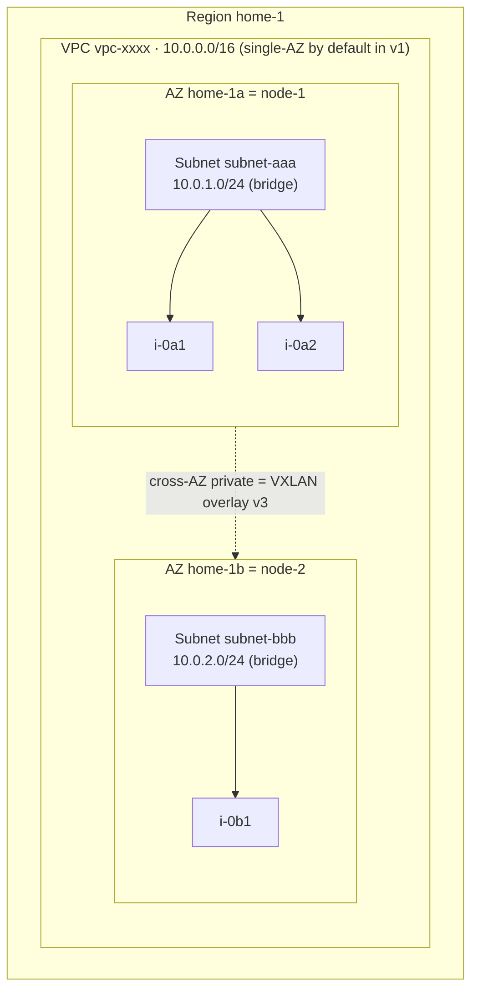
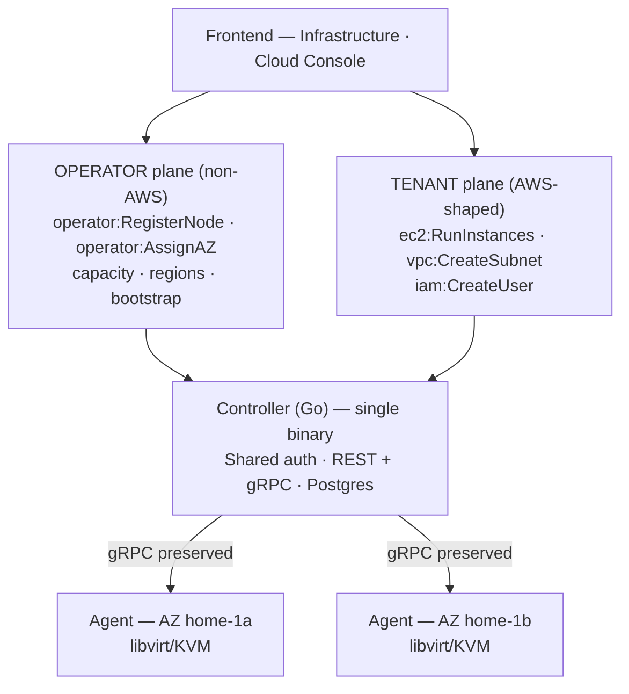
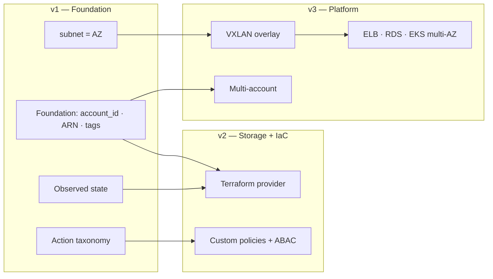

# RigStack → AWS-like Cloud: Migration & Adequacy Plan

> **Type:** Architecture & migration plan (consulting deliverable)
> **Author:** Ronaldo Rodrigues — IaC/Cloud Infrastructure Consultant
> **Date:** 2026-06-02
> **Status:** Proposal for presentation
> **Deliverable scope:** the *plan* (decisions, target architecture, roadmap, risks). Implementation not included.
>
> *Portuguese source of truth: [`aws-adequacao-plan.md`](./aws-adequacao-plan.md).*

---

## 1. Executive summary

RigStack is already a working private cloud for homelabs: it provisions VMs (libvirt/KVM), VPC networks (Linux bridge + NAT), and has a solid controller+agent model over gRPC. This plan proposes to **reshape RigStack into the AWS mental model** — not to be *wire-compatible* with AWS, but so homelab enthusiasts manage their infrastructure with the same concepts (EC2, VPC, Subnet, Security Group, IAM, ARNs) and then **as code** through a native Terraform/OpenTofu provider.

**North-star:** *"Your own cloud, with AWS's mental model, on your own hardware — manageable as IaC."*

**Principles that drove every decision:**

1. **Reuse what's worth gold.** The agent (libvirt, bridges, iptables, netns, curl bootstrap) and the controller↔agent gRPC are preserved and extended. The redesign concentrates on the domain model and the API.
2. **Mimic AWS where it serves the homelab; diverge consciously where it doesn't.** The audience runs 1–3 machines; the plan stops imitating AWS complexity exactly where it stops adding value.
3. **Carry the foundation early.** `account_id`, full ARNs and AZ slots land in v1 — because adding them later breaks persisted identifiers, IAM policies and Terraform state.
4. **Scope honesty.** AWS wire-compatibility and multi-AZ routing are explicitly deferred, with the reasoning documented.

**The three phases:**

| Phase | Theme | Deliverables |
|------|------|----------|
| **v1** | AWS-shaped foundation | EC2, VPC + Subnet, Security Groups, single-account IAM, `account_id`/ARNs/AWS-style IDs, two API planes |
| **v2** | Storage + DX/IaC | S3 (MinIO), EBS-like volumes, Elastic IP, `rigstack` CLI, **Terraform provider** |
| **v3** | Distributed platform | VXLAN overlay (unlocks multi-AZ), ELB, RDS, EKS, multi-account |

---

## 2. Current-state assessment (evidence-based)

The plan is grounded in a reading of the repository, not assumptions. Findings that shape the target design:

### 2.1 What already works and will be reused
- **Controller** (Go, REST `:8080` + gRPC `:9090`, PostgreSQL): *least-loaded* scheduler, heartbeat dispatcher. Solid.
- **Agent** (Go, bare-metal/systemd): libvirt/KVM, Linux bridge, iptables NAT, network namespace, qcow2 provisioning, **`curl | sh` bootstrap** (k3s-style). The *crown jewel*.
- **Frontend** (React): already has *ComingSoon* pages for IAM, Object Storage, Load Balancer, Databases, Kubernetes, Containers — the visual ambition exists.
- **Schema**: tables `nodes`, `vpcs`, `subnets`, `nat_gateways`, `instances`, `users` already exist.

### 2.2 Structural gaps (what the plan must solve)

| # | Finding (file) | Impact |
|---|------------------|---------|
| **G1** | **A VPC lives on a single node.** `VPCService.Create` (`vpc.go:38`) creates the bridge on *one* node via `PickNode`; `InstanceService.Create` (`instance.go:99`) calls `PickNode` **independently** — the VM may land on a different node than the bridge. No overlay (VXLAN/Geneve). | Multi-node networking is effectively **broken**. The central technical constraint of the plan. |
| **G2** | **`subnets` table exists but is ignored.** `allocateIP` (`instance.go:219`) allocates straight off the VPC CIDR, sequentially from `.11`. | No real IPAM, no AWS subnet=AZ concept. |
| **G3** | **Zero authentication.** `auth.go` is CORS-only; a comment promises "Phase B: JWT". The `users` table (`admin/developer/viewer`) isn't wired to any login. | IAM and auth are *greenfield* — upside: design it right from the start. |
| **G4** | **No `account_id`/owner on any resource.** Resources are global in the controller. | Multi-tenancy and per-resource IAM need a new foundation. |
| **G5** | **`region` is a loose string on the node.** No AZ, no regions table, no ARNs. | AWS topology must be introduced. |
| **G6** | **Scheduling decoupled from networking.** Scheduler picks by free RAM, ignoring where the instance's subnet/bridge lives. | Naturally fixed by the subnet=AZ model. |

---

## 3. Target architecture

### 3.1 Conceptual model (RigStack → AWS mapping)

| AWS concept | RigStack target | Physical realization |
|---|---|---|
| Account | Single account in v1 (`account_id` carried early) | `account_id` column on every resource |
| Region | `home-1` (single in v1) | The whole deployment |
| Availability Zone | **Stable logical slot** (`home-1a`, `home-1b`…) | A **node assigned** to the slot |
| EC2 instance (`i-`) | Instance | libvirt/KVM VM on the AZ's node |
| AMI (`ami-`) | Image | base qcow2 in `/var/lib/rigstack/base/` |
| VPC (`vpc-`) | VPC — regional CIDR umbrella, **single-AZ by default in v1** | Logical concept |
| Subnet (`subnet-`) | Subnet — **scoped to one AZ** | Linux bridge on that slot's node |
| Security Group (`sg-`) | Security Group — stateful | per-VM iptables (conntrack) |
| Internet Gateway (`igw-`) | IGW per VPC | Reuses NAT gateway (netns) |
| Elastic IP (`eip-`) | EIP (v2) | iptables DNAT |
| EBS volume (`vol-`) | Volume (v2) | attachable qcow2, AZ-scoped |
| IAM user/group/role/policy | IAM (single-account v1) | `users` table + policies |

**Preserved invariant:** in AWS, everything inside a VPC talks over private IP. Since there is no overlay in v1, **a VPC is single-AZ by default** — keeping AWS semantics *correct but limited* rather than *AWS-shaped but wrong*. Multi-AZ VPC is unlocked by the overlay (v3).

**AZ = slot, not node:** decommissioning a node **does not destroy the AZ**. The node is *assigned* to the slot; swap the machine and the AZ persists (its resources are unavailable until a node re-occupies the slot). The AZ stays **hidden in the UI until there are 2+ nodes**.

### 3.2 Two API planes

The homelab owner wears two hats — infrastructure operator and cloud user. The API reflects this:

- **Same binary, same auth** (§3.3); **distinct route namespaces and IAM action taxonomies**.
- The current `/api/v1/nodes` and `/agent/install.sh` move to the **operator plane**.
- The operator plane is where future **multi-account** management (v3) will live.

### 3.3 Authentication & authorization

- **Console (UI):** username/password login → session **JWT**.
- **Programmatic (CLI/Terraform):** **Access Key ID + Secret Access Key**, sent as a **bearer over TLS** — **not SigV4**. The secret is stored only as a **salted hash (Argon2id)**, shown once (see ADR-013). `rigstack configure` mirrors `aws configure`; the provider takes `access_key`/`secret_key` like the AWS provider. Keys are scoped to an IAM user/role, shown **only once**.
- **IAM (authorization):** AWS structure (users/groups/roles) + `Effect/Action/Resource` format. **v1:** a curated catalog of *managed policies* (`AdministratorAccess`, `EC2FullAccess`, `VPCReadOnly`, `OperatorAccess`…), **no `Condition`**, service-level matching, simple evaluator (Deny wins; explicit Allow beats absence). The **per-service action taxonomy is defined in v1** — it's the vocabulary that v2/v3 custom policies consume.

### 3.4 Resource identity

- **Full ARN from v1:** `arn:rigstack:<service>:<region>:<account>:<type>/<id>`
  - e.g. `arn:rigstack:ec2:home-1:000000000001:instance/i-0a1b2c3d`
  - `region` and `account` **filled** even with one of each (blank-then-fill would break stored ARNs and Terraform state).
- **AWS-style IDs, prefixes decided upfront:** `i-`, `vol-`, `vpc-`, `subnet-`, `sg-`, `igw-`, `nat-`, `eip-`, `key-`, `ami-`. Deterministic, per-type-unique ID generator in the foundation.

---

## 4. Architecture Decision Records (ADRs)

> Each ADR records context, options, decision and the **rejected alternative with its reason** — the defensibility of the plan.

### ADR-001 — AWS model parity, not wire-compatibility
- **Decision:** Adopt AWS's *model/UX* with our own API (B), followed by a native Terraform provider (C).
- **Rejected:** Wire-compatibility (A, LocalStack-style — EC2 query/XML + SigV4). Reason: would rewrite the current API to imitate a huge, moving external target, terrible ROI for a homelab, and creates an impossible "drop-in AWS" expectation. **You don't need wire-compat to be IaC-managed** — every cloud has its own provider.

### ADR-002 — Multi-user, single-account in v1
- **Decision:** Many people, one account (b). Every resource carries `account_id`/owner from day 1.
- **Rejected:** Pure single-tenant (a) — would kill IAM and the AWS thread. Full multi-account (c) — a v1 scope trap (real per-account isolation of network/storage/compute). The carried foundation enables (c) without re-migrating.

### ADR-003 — Topology: AZ = logical slot, single-AZ VPC in v1
- **Decision:** Single region; **AZ = stable slot** with an assigned node; **subnet scoped to the AZ** (= a bridge on the node); single-AZ VPC by default; instance placement derived from the subnet. AZ hidden until 2+ nodes.
- **Rejected:** Building a cross-node VXLAN overlay in v1 (a). Reason: eliminates no risk, only front-loads the hardest engineering against the reuse goal, for a benefit the 1-node homelabber won't use.
- **Accepted risks:** see R1–R3 in §6.

### ADR-004 — Phased scope v1/v2/v3
- **Decision:** v1 reuses+reorganizes (low risk, demonstrable); v2 delivers IaC value; v3 is the heavy distributed-infra work. See §5.

### ADR-005 — Hybrid auth (JWT + Access Keys, **bearer**, no SigV4)
- **Decision:** Console JWT; programmatic Access Key/Secret as a **bearer over TLS**. The **bearer (not HMAC)** choice is sealed by ADR-013: HMAC would force reversible secret storage, against the irrecoverable-auth-secret principle.
- **Rejected:** Full SigV4 (a) — reintroduces the wire-compat cost rejected in ADR-001, on the server *and* in the CLI/provider. HMAC — forces reversible secret storage (see ADR-013).

### ADR-006 — IAM: AWS structure + curated managed policies
- **Decision:** AWS policy structure and format, but v1 ships only a curated catalog, no `Condition`, service-level matching; action taxonomy defined in v1.
- **Rejected:** Full policy engine (b, ARN wildcards + conditions) in v1 — the most expensive IAM item, deferrable. Simple RBAC (a) — not IAM, breaks parity.

### ADR-007 — Full ARN from day 1
- **Decision:** Full AWS format with region/account filled.
- **Rejected:** Simplified ARN with blank fields (b) — filling them later breaks ARNs in IAM policies and users' Terraform state.

### ADR-008 — Hybrid evolution, clean-field API
- **Decision:** Preserve+extend agent/gRPC/executor; redesign controller service/store/API; **no API backward-compat** (no installed base); additive migrations + one data migration.
- **Rejected:** Full rebuild (b) — discards the crown jewel. Evolving everything in place keeping the old API (part of a) — carries compatibility debt nobody asked for.

### ADR-009 — Two API planes (operator + tenant)
- **Decision:** Operator plane (non-AWS, hardware) separate from the tenant plane (AWS-shaped). Same binary and auth; distinct namespaces.
- **Rejected:** Unified API (a) — would leak `nodes` into the AWS-shaped API, breaking the illusion and muddying IAM.

### ADR-010 — Stateful Security Groups via iptables (v1), SG-to-SG in v2
- **Decision:** **Stateful** SGs (conntrack, not stateless NACL), applied as **per-VM iptables chains on the agent** (host-level, bypass-proof from the tenant); default **deny inbound / allow all outbound**; **default SG per VPC** with **self-reference** (instances in the same default SG talk to each other). v1 rules by **CIDR** + the default's self-reference.
- **Rejected/deferred:** Arbitrary **SG-to-SG references** (b) → **v2**, because they require dynamic *membership* propagation (controller resolves SG→IPs and re-propagates to agents on each change), which fits v2's mature observed state and custom policies. CIDR-only without self-reference (c) — SGs become crude. **NACLs** (stateless, subnet-level) — out of scope / v3.

### ADR-011 — VXLAN overlay with controller-driven unicast FDB (v3)
- **Decision:** **VXLAN** (kernel-native L2/UDP, fits the existing Linux bridges) as the cross-node overlay. **Control plane = controller-driven unicast FDB** (head-end replication over the existing dispatch channel) — **no multicast** (breaks on most home LANs). MTU overhead (~50 bytes) handled via jumbo frames or reduced MTU (documented).
- **Rejected:** Geneve (b)/OVN-OVS (d) — operationally too heavy for a homelab. Multicast FDB — unavailable on the typical home LAN.
- **Reserved:** **WireGuard** for **multi-site/multi-region** (L3 encrypted tunnel over the internet) — a distinct use case, future phase.
- **Trigger:** the overlay is a **prerequisite for any multi-AZ service** (cross-AZ ELB, RDS replica, multi-AZ EKS).

### ADR-012 — Tags as first-class metadata in v1; ABAC in v2
- **Decision:** A `tags` (JSONB) key/value column on **every resource from v1** (same carry-early logic as `account_id`/ARN), with the `Name` tag convention for display and tags filterable in `Describe*`. **Organization/filter semantics only** in v1.
- **Rejected:** Tags + ABAC in v1 (b) — would bring `Condition` back into v1, against ADR-006. Tags only in v2 (c) — v1 resources would be born untaggable and Terraform users expect `tags = {...}` on day 1.
- **Deferred:** tag-based access control (ABAC, `aws:ResourceTag/...`) lands with `Condition` in v2.

### ADR-013 — Secrets: hash for auth, encrypt-at-rest for the retrievable
- **Decision:** Two treatments by secret type. **Access Key secret → salted hash (Argon2id)**, irrecoverable, shown once (seals bearer in ADR-005). **Instance password → encrypted at rest** with a controller master key sourced from env/secret file (**never the DB**), preserving the UX of retrieving the password in the console. The v1 migration encrypts existing plaintext passwords (`instance_password`).
- **Rejected:** Encrypt everything at rest (b) — would enable HMAC but concentrates risk (leaked DB + master key = total compromise) and makes master-key management a central problem. Full AWS fidelity (c) — no retrievable password, encrypted with the user's SSH public key; more secure but changes the UX. Noted as **future hardening**.

### ADR-014 — Lightweight per-user quotas in v1
- **Decision:** **Per-user** quotas on real-capacity dimensions (running instances, total vCPUs, total RAM; volume GB in v2), checked in the controller at *create*, with an admin-adjustable default. This is the guardrail that makes multi-user (ADR-002) safe.
- **Rejected:** Quotas only in v2 (b) — leaves an operational hole open through all of v1 (a user/Terraform loop exhausts the cluster). Physical capacity only (c) — no fairness between users before hardware fills.
- **Deferred:** full Service Quotas catalog + UX + **per-account** quotas → v2 (per-account quota depends on v3 multi-account).

### ADR-015 — Observed state in v1; active reconciliation in v3
- **Decision:** Separate *read drift* from *auto-remediation*. **v1 (foundation):** every resource has `desired` + `observed`; the agent reports the observed on the heartbeat (extends the current heartbeat); `Describe*` exposes the observed truthfully (out-of-band deletion/change becomes `status`). This is what v2's `terraform refresh` needs. **v3:** active reconciliation loop with self-heal.
- **Rejected:** Active reconciliation/self-heal in v1 (a) — XL, over-engineering for a homelab; fits v3's platform/HA work. No drift handling (c) — the v2 provider would be born lying.

### ADR-016 — Snapshots + create-AMI-from-instance in v2
- **Decision:** Volume snapshot + capturing an instance as an `ami-` image (golden image), in **v2**, paired with the volumes feature. Reuses qcow2's native snapshot support (`qemu-img`). Depends on the AMI catalog (v1) and the volume/EBS model (v2).
- **Rejected:** v1 (inflates v1, which is reorganization only). v3 (delays a high-value, low-cost golden-image workflow). Out of scope (c) — wastes an almost-free qcow2 capability.
- **Detail:** snapshotting a running VM needs quiesce/`fsfreeze` (consistent) or accepts crash-consistent — an implementation choice.

### ADR-017 — IPv4-only in v1/v2; IPv6 declared out of scope
- **Decision:** **IPv4-only** stack in v1 and v2. IPv6/dual-stack is **explicitly out of scope** (not omitted), a v3 candidate, co-located with the overlay network rework.
- **Rejected:** Dual-stack in v1 (b) — crosses the whole network (IPAM, v6/ICMPv6 SGs, NAT/IGW, agent bridge) for a benefit rare in the MVP. v2 (c) — there's no network trigger in v2.

### ADR-018 — Public connectivity: conscious divergence from AWS
- **Context:** AWS has a public-IP pool; a homelab sits behind the home router (one public IP, or none routable). RigStack only controls connectivity **up to the node's uplink**.
- **Decision:** **IGW in v1** = egress + node-LAN reachability, reusing the current NAT gateway (SNAT); a public subnet auto-assigns LAN reachability. **Elastic IP in v2** = a **DNAT mapping on the node's uplink** (LAN IP/port) → the instance's private IP. **True internet exposure = the operator's router port-forward** — a documented responsibility boundary, outside RigStack's control.
- **Rejected:** AWS-faithful public-IP pool (b) — fantasy for a homelab. No public/inbound concept (c) — kills the service-hosting use case.
- **Note:** explicitly recorded as a **conscious divergence from AWS** — where imitating AWS would stop serving the homelab.

### ADR-019 — AMI: per-node catalog in v1, central distribution via S3 in v2
- **Context:** With AZ = node (ADR-003), an AMI's qcow2 must exist **physically on the launch node**; today it's downloaded manually per node.
- **Decision:** **v1** — AMI = catalog metadata + the controller **tracks per-node/AZ availability** and the scheduler **filters AZs lacking the target AMI** (eliminates the launch that fails without explanation). **v2** — images move to the **S3/MinIO** store; nodes pull/cache on launch → the AWS feel of "AMI available region-wide".
- **Rejected:** Orchestrated distribution in v1 (b/c) — depends on a central store that only exists in v2. Blind catalog without tracking (status quo) — launch fails without explanation.
- **Dependency:** AMI distribution **and** custom AMI (ADR-016) depend on S3 (v2).

### ADR-020 — AWS-shaped naming, renameable, honest
- **Decision:** Region follows the AWS *shape* (lowercase, hyphen, trailing number), **operator-renameable**, default `home-1`. **AZ auto-derived** as region+letter (`home-1a`, `home-1b`). **Account = 12-digit zero-padded number** (`000000000001`) for ARN/Terraform-state fidelity.
- **Rejected:** Pure mimicry (`us-east-1`) (b) — confusing/dishonest. Free-form (c) — breaks ARN consistency and Terraform expectations.

---

## 5. Phased roadmap

### Phase v1 — AWS-shaped foundation
**Goal:** what already exists, reorganized with AWS's model, identity and security.

- Foundation: `account_id`/owner on every resource; ID generator + ARNs; single account and region; **`tags` (JSONB) column + `Name` tag** on every resource.
- **IAM:** users/groups/roles, JWT login, Access Keys (secret as Argon2id hash, show-once), managed-policy catalog, action taxonomy (operator + tenant).
- **Secrets:** controller master key (env/secret file); encrypt-at-rest of the instance password + migration of existing plaintext passwords.
- **Observed state:** `desired`/`observed` model on every resource; agent reports observed on the heartbeat; `Describe*` exposes reality (basis for v2's `terraform refresh`).
- **Two API planes** with distinct namespaces and taxonomies.
- **EC2:** reshape `instances` → `ec2:RunInstances/DescribeInstances/...`; **AMI** catalog (`ami-`) from base images, with **per-node/AZ availability tracking** and the scheduler filtering AZs lacking the image.
- **VPC + Subnet:** activate the `subnets` table; real IPAM (non-overlapping CIDRs, reserved addresses); **instance placement derived from the subnet** (fixes G1/G6 in single-AZ scope); IGW = egress + LAN reachability (reuses NAT/SNAT); public subnet.
- **Security Groups:** stateful via iptables (per-VM chains), default SG per VPC with self-reference; CIDR rules (arbitrary SG-to-SG → v2).
- **Quotas:** lightweight per-user quota (instances/vCPU/RAM) checked at *create*; admin-adjustable default.
- One-time migration of existing data (default subnet per VPC, instance re-association).
- Frontend: IAM/Network ComingSoon → real; Infrastructure (operator) area.

### Phase v2 — Storage + DX/IaC
- **S3** (MinIO) with a bucket/object model + policies.
- **Central AMI distribution:** images in the S3 store; nodes pull/cache on launch (replaces v1's manual staging).
- **EBS-like:** first-class attachable qcow2 volumes, AZ-scoped (`vol-`).
- **Snapshots + custom AMI:** volume snapshot + capturing an instance as `ami-` (golden image), via `qemu-img`.
- **Elastic IP** = DNAT on the node uplink → private IP (internet exposure = operator's router port-forward, see ADR-018).
- **`rigstack` CLI** (`aws`-like UX).
- **Native Terraform/OpenTofu provider** — the heart of the IaC positioning.
- IAM: custom policy authoring + `Condition` + fine ARN matching.
- **Arbitrary SG-to-SG:** dynamic membership propagation (controller resolves SG→IPs and re-propagates to agents).

### Phase v3 — Distributed platform
- **VXLAN overlay** → unlocks multi-AZ VPC (fully resolves G1).
- **ELB** (HAProxy/Nginx), cross-AZ.
- **RDS** (managed Postgres/MySQL), multi-AZ replicas.
- **EKS** (managed k3s).
- **Multi-account** (real isolation) — enabled by the `account_id` foundation.
- **Active reconciliation + self-heal** (Kubernetes-style) over v1's observed state.
- **IPv6/dual-stack** (candidate) — co-located with the overlay network rework.

**Critical dependencies:** Foundation(v1) → everything. subnet=AZ(v1) → overlay(v3) → {ELB, RDS, EKS} multi-AZ. Action taxonomy(v1) → custom policies(v2). Full ARN(v1) **+ observed state(v1)** → Terraform provider(v2).

---

## 6. Risk register

| ID | Risk | Severity | Mitigation (in the plan) |
|----|-------|-----------|----------------------|
| **R1** | VPC becomes a leaky abstraction (private-routing invariant) until the overlay | High | **Single-AZ VPC by default in v1** (ADR-003); multi-AZ gated on the overlay |
| **R2** | "AZ=node" unstable (decommissioning a node destroys an AZ) | High | **AZ = logical slot**; node *assigned*, isn't the AZ (ADR-003) |
| **R3** | Scheduling regression (subnet pinned to a node) | Medium | Scheduler picks AZ/node at subnet creation; user spreads via multiple subnets — like AWS |
| **R4** | Deferred overlay never gets built; compounding debt | Medium | Overlay marked as a **gating prerequisite** for every multi-AZ service (ADR-011) |
| **R5** | Over-engineering AZ for the 1-node homelab | Low | AZ hidden/auto-managed until 2+ nodes |
| **R6** | Poor IPAM causes IP conflicts | Medium | Real IPAM in v1 (non-overlapping CIDRs, reserved) |
| **R7** | Changing the action taxonomy later breaks policies | Medium | Taxonomy defined and versioned in v1 (ADR-006) |
| **R8** | Migrating existing data corrupts installations | Low | Clean-field API + one tested migration; small installs |
| **R9** | Instance password is plaintext today (`instance_password`) | High | Encrypt-at-rest in v1 + master key outside the DB (ADR-013) |
| **R10** | Leaked master key compromises encrypted passwords | Medium | Master key in env/secret file, outside the DB; rotation noted as hardening |

---

## 7. Effort sizing (relative t-shirt sizing)

> No calendar-time commitment: this is a community open-source project with no fixed team. Relative size + dependency order communicates effort honestly.

| Epic | Phase | Size | Note |
|-------|------|:------:|-----------|
| Foundation (account_id, IDs, ARNs, region/account, **tags**) | v1 | **M** | Touches the whole schema; low technical risk |
| IAM (JWT auth, Access Keys, managed policies, taxonomy) | v1 | **L** | Largest blast radius in v1 |
| Two API planes | v1 | **S** | Route reorganization |
| EC2 + AMI | v1 | **S** | Reuses instances/images |
| VPC + Subnet + IPAM (single-AZ) | v1 | **M** | Activates dormant table; fixes G1/G6 |
| Security Groups | v1 | **M** | Stateful per-VM iptables logic |
| Lightweight per-user quotas | v1 | **S** | Count query + check at *create* |
| Observed state (`desired`/`observed`) | v1 | **S** | Extends the current heartbeat |
| Data migration + v1 frontend | v1 | **S** | — |
| S3 (MinIO) | v2 | **M** | New service |
| EBS-like + Elastic IP | v2 | **M** | — |
| Snapshots + custom AMI | v2 | **M** | Reuses `qemu-img`; depends on volumes |
| `rigstack` CLI | v2 | **M** | — |
| **Terraform provider** | v2 | **L** | Heart of IaC; depends on stable ARN/API |
| **VXLAN overlay** | v3 | **XL** | Hardest item of the project |
| ELB / RDS / EKS | v3 | **XL** each | Depend on the overlay |
| Active reconciliation + self-heal | v3 | **L** | Over v1's observed state |
| Multi-account | v3 | **L** | Enabled by the foundation |

---

## 8. Appendix — Reference conventions

- **ARN:** `arn:rigstack:<service>:<region>:<account>:<type>/<id>`
- **Region:** AWS *shape*, operator-renameable, default `home-1` · **AZ:** auto-derived `home-1a`, `home-1b`, …
- **Account:** 12-digit zero-padded number, default `000000000001`
- **ID prefixes:** `i-` `vol-` `vpc-` `subnet-` `sg-` `igw-` `nat-` `eip-` `key-` `ami-`
- **Action taxonomy (examples):**
  - Tenant: `ec2:RunInstances`, `ec2:DescribeInstances`, `vpc:CreateSubnet`, `sg:AuthorizeIngress`, `iam:CreateUser`, `s3:PutObject`
  - Operator: `operator:RegisterNode`, `operator:AssignAZ`, `operator:DescribeCapacity`, `operator:BootstrapAgent`
- **v1 managed policies (initial catalog):** `AdministratorAccess`, `OperatorAccess`, `EC2FullAccess`, `VPCFullAccess`, `IAMReadOnly`, `ReadOnlyAccess`
