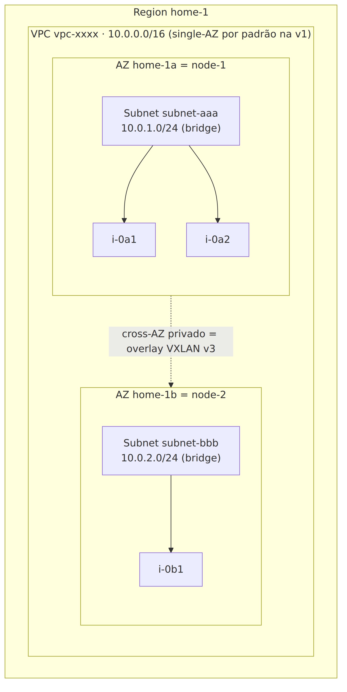
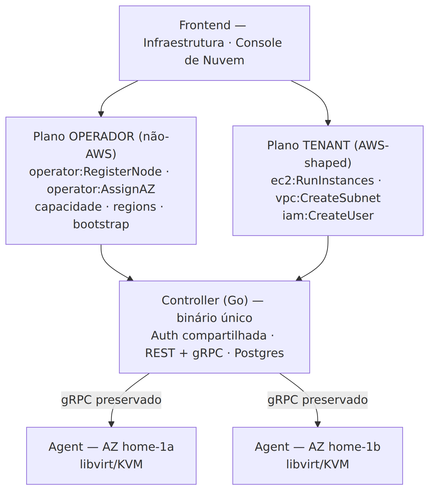
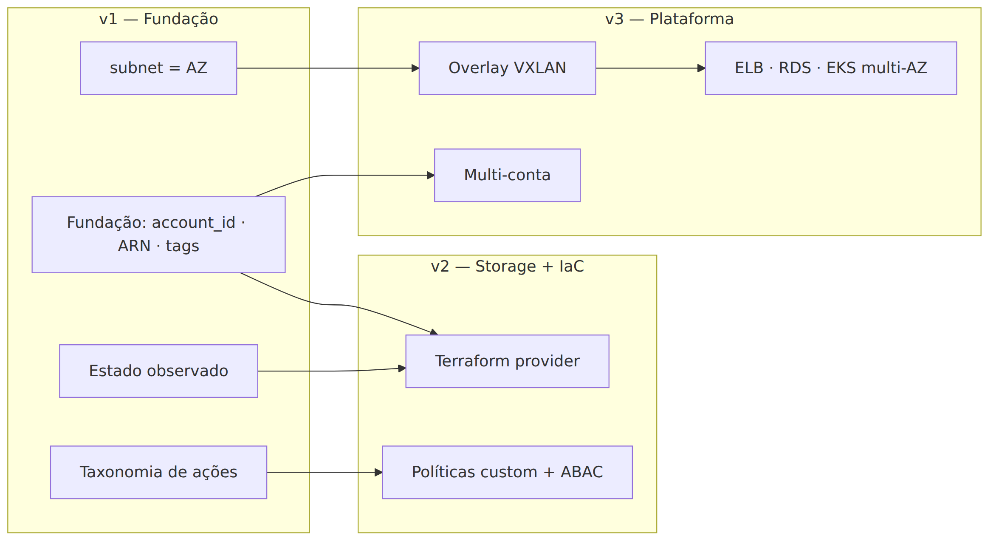

<!-- _paginate: false -->

# RigStack → Nuvem AWS-like
## Plano de adequação

**Ronaldo Rodrigues** — Consultor de Infraestrutura IaC/Cloud
2026-06-02 · Proposta para apresentação

> *Entregável: o plano (decisões, arquitetura-alvo, roadmap, riscos). Implementação fora de escopo.*

---

## O objetivo

Transformar o RigStack em uma **nuvem privada com o modelo mental da AWS** — para entusiastas de homelab gerenciarem sua infraestrutura com os mesmos conceitos (EC2, VPC, Subnet, SG, IAM, ARNs)… e depois **como código** (Terraform).

### North-star
> *"Sua própria nuvem, com o modelo mental da AWS, no seu hardware — gerenciável por IaC."*

**Não** é ser *wire-compatible* com a AWS. É **paridade de modelo**, não imitação de protocolo.

---

## O RigStack já é meio-caminho

- **Controller** Go (REST + gRPC + PostgreSQL): scheduler + dispatcher
- **Agent** bare-metal: libvirt/KVM, bridges, iptables, bootstrap via `curl | sh`
- **Frontend** React com páginas já planejadas (IAM, S3, LB, K8s…)
- Domínio atual (`nodes`, `vpcs`, `instances`, `images`) **já é quase EC2/VPC**

➡️ O plano **reaproveita** o que é difícil (agent/rede/gRPC) e **redesenha** só o modelo e a API.

---

## Estado atual: o achado que muda tudo

**G1 — a VPC vive em um único node.**
A bridge nasce em um node; a VM pode cair em outro; **não há overlay**.

> Rede multi-node está, na prática, **quebrada** hoje.

Outros achados: `subnets` existe mas é ignorada · **zero autenticação** · sem `account_id` · `region` é só uma string.

➡️ O plano nasce de **evidência no código**, não de achismo. Isso dá credibilidade.

---

## A decisão-raiz (ADR-001)

|  | Paridade de modelo (escolhido) | Wire-compat AWS (rejeitado) |
|---|---|---|
| Esforço | Reaproveita a base | Reescreve a API (SigV4, XML…) |
| Risco | Expectativa honesta | "Drop-in AWS" impossível |
| IaC | Provider próprio (como toda nuvem) | Não é pré-requisito |

**Não se precisa de wire-compat para ser gerenciável por IaC.**

---

## Os 4 princípios

1. **Reaproveitar o que vale ouro** — agent/rede/gRPC preservados.
2. **Imitar a AWS onde serve ao homelab; divergir conscientemente onde não.**
3. **Carregar a fundação cedo** — `account_id`, ARNs, slots de AZ na v1.
4. **Honestidade de escopo** — overlay e wire-compat adiados *com o porquê*.

---

## Arquitetura-alvo: mapeamento AWS

| AWS | RigStack | Realização física |
|---|---|---|
| Account | conta única (v1) | `account_id` em todo recurso |
| Region / AZ | `home-1` / slot lógico | node atribuído ao slot |
| EC2 / AMI | Instance / Image | VM libvirt no node da AZ |
| VPC / Subnet | umbrella / por-AZ | bridge no node do slot |
| Security Group | SG stateful | iptables por-VM |
| IAM | users/roles/policies | tabela `users` + políticas |

---

## Topologia: AZ = slot, não node (ADR-003)

- **AZ = slot lógico estável**; o node é *atribuído* a ele.
  → decomissionar um node **não destrói a AZ**.
- **Subnet escopada à AZ** = bridge no node → **conserta o G1** (instância vai pro node da sua subnet).
- **VPC single-AZ por padrão na v1** → preserva o invariante AWS de roteamento privado.
- AZ **oculta na UI** até haver 2+ nodes.

➡️ VPC multi-AZ é destravada pelo **overlay VXLAN (v3)**.

---

## Topologia (visual)

---

## Dois planos de API (ADR-009)

O dono usa **dois chapéus**: operador de hardware **e** usuário de nuvem.
Separar mantém o plano tenant **limpo e fiel à AWS**.

---

## Identidade & Segurança

- **ARN completo desde a v1:** `arn:rigstack:ec2:home-1:000000000001:instance/i-0abc`
- **Auth:** console **JWT**; CLI/Terraform **Access Key + Secret** (bearer/TLS, **sem SigV4**)
- **Segredos:** secret de Access Key em **hash** (Argon2id); senha de VM **cifrada em repouso**
- **IAM:** estrutura AWS + **managed policies curadas** (v1); políticas custom + ABAC (v2)
- **Quotas leves por usuário** na v1 (guardrail do multi-user)

---

## Roadmap em 3 fases

| Fase | Tema | Destaques |
|---|---|---|
| **v1** | Fundação AWS-shaped | EC2, VPC+Subnet, SG, IAM, ARNs, tags, 2 planos, estado observado |
| **v2** | Storage + DX/IaC | S3, volumes EBS, snapshots, EIP, **CLI + Terraform provider** |
| **v3** | Plataforma distribuída | **Overlay VXLAN**, ELB, RDS, EKS, multi-conta |

**Dependências:** Fundação → tudo · subnet=AZ → overlay → {ELB,RDS,EKS} · ARN+estado observado → provider

---

## Dependências entre fases (visual)

---

## Riscos principais

| Risco | Sev. | Mitigação |
|---|:--:|---|
| VPC furada até o overlay | Alta | **VPC single-AZ por padrão** na v1 |
| AZ=node instável | Alta | **AZ = slot lógico** |
| Senha de VM em texto claro hoje | Alta | **Cifra-em-repouso** na v1 |
| Overlay adiado vira dívida | Média | Marcado como **pré-requisito gatilho** |

---

## Esforço (t-shirt sizing)

*Sem prazo-calendário — projeto de comunidade, sem time fixo.*

- **v1:** Fundação **M** · IAM **L** · VPC/Subnet **M** · SG **M** · resto **S**
- **v2:** Terraform provider **L** · S3/EBS/Snapshots/CLI **M**
- **v3:** **Overlay VXLAN XL** · ELB/RDS/EKS **XL cada**

➡️ A v1 é majoritariamente **reaproveitamento + reorganização** → baixo risco, demonstrável.

---

## Divergências conscientes da AWS

Onde imitar a AWS **deixaria de servir** ao homelab:

- **Sem pool de IPs públicos** → IGW/EIP fazem DNAT na uplink; internet = roteador do operador (documentado)
- **AZ visível só com 2+ nodes** → não sobrecarrega o homelab de 1 máquina
- **IPv4-only** em v1/v2 → IPv6 declarado fora de escopo
- **IAM sem `Condition`** na v1 → managed policies curadas

➡️ Divergir *conscientemente e documentado* é o que dá credibilidade ao plano.

---

<!-- _paginate: false -->

## Próximos passos

1. Validar o **escopo da v1** e os 20 ADRs
2. Detalhar **IPAM** e o **control plane do VXLAN**
3. Prototipar a **fundação** (account_id, ARNs, tags, auth)

### Entregáveis
- `docs/aws-adequacao-plan.md` (PT) · `docs/aws-migration-plan.md` (EN)
- 20 ADRs · riscos R1–R10 · roadmap · sizing

**Obrigado.** Perguntas?
